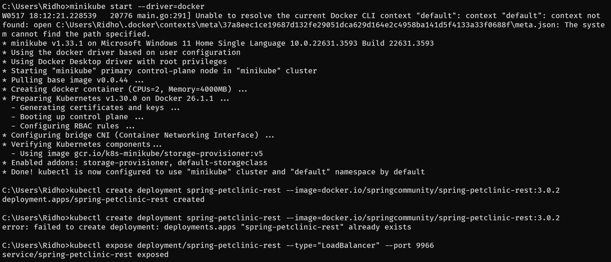
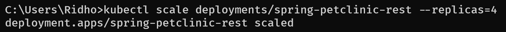
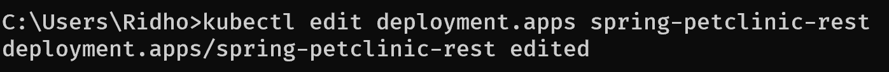
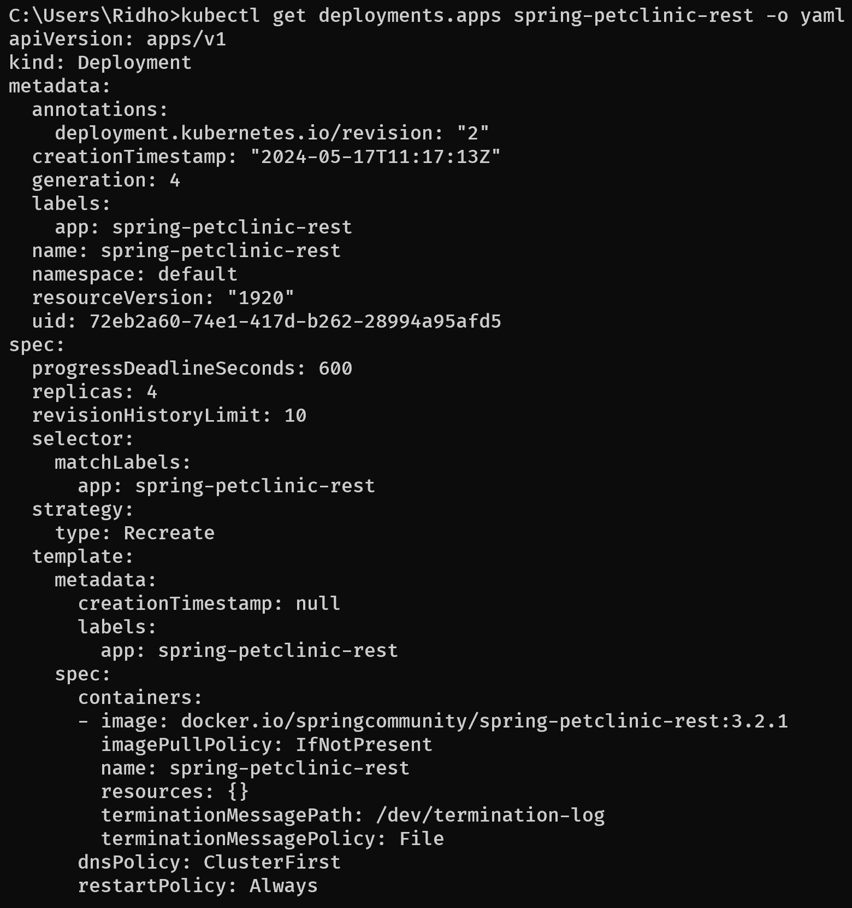
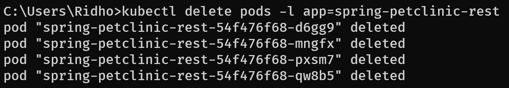
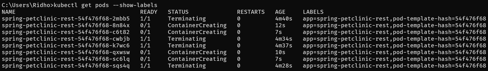
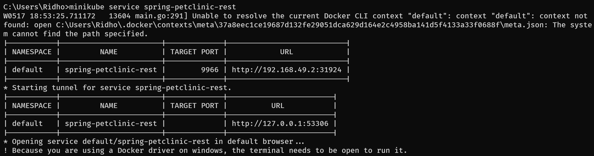
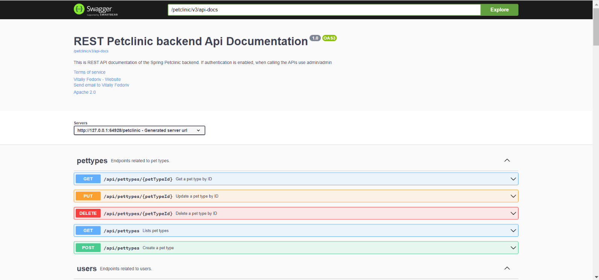
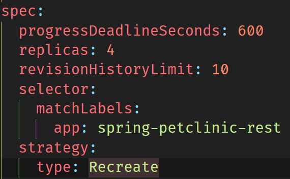

# Tutorial for Advance Programming Course 2023/2024

**Nama** : **Restu Ahmad Ar Ridho**  
**NPM** : **2206028951**  
**Kelas** : **Advance Programming - A**

## Module 11 - Deployment on Kubernetes

### Reflection on Hello Minikube
1. Compare the application logs before and after you exposed it as a Service.  
    
    > Hasil dari `kubectl logs hello-node` sebelum melakukan exposing pod.

    
    > Service `hello-node` yang diexpose.

    
    > Hasil dari `kubectl logs hello-node` sesudah melakukan exposing pod.

    Setelah mengekspos _service_, _service_ dapat menerima permintaan dari luar minikube, sehingga log akan mencatat setiap permintaan yang masuk. Misalnya, jika dilakukan beberapa kali membuka app terhadap _service_ hello-node, log akan menunjukkan entri baru untuk setiap permintaan yang diterima oleh _service_ tersebut. Ini mencerminkan aktivitas permintaan yang dihasilkan oleh pengguna yang mengakses _service_ melalui URL yang terkait dengan _service_ tersebut.

2. Notice that there are two versions of `kubectl get` invocation during this tutorial section. What is the purpose of the `-n` option and why did the output not list the pods/services that you explicitly created?  
  Perbedaan antara kedua sintaks tersebut adalah bahwa dengan menggunakan opsi -n, kita menyatakan bahwa layanan yang kita inginkan berada pada namespace tertentu. Hal ini penting jika terdapat banyak layanan berbeda dengan nama yang sama di berbagai namespace. Dengan menggunakan -n, kita memfokuskan pencarian pada namespace yang ditentukan setelah opsi -n. Misalnya, kubectl get pods -n kube-system hanya akan menampilkan pod di namespace kube-system, sehingga menghindari kebingungan dengan pod-pod di namespace lain yang mungkin memiliki nama serupa.

### Reflection on Rolling Update & Kubernetes Manifest File
1. What is the difference between Rolling Update and Recreate deployment strategy?  
Perbedaan antara strategi penerapan Rolling Update dan Recreate di Kubernetes terletak pada penanganan pembaruan aplikasi. Rolling Update, strategi default, secara bertahap mengganti versi lama dengan versi baru, memastikan bahwa sejumlah pod tetap berjalan selama pembaruan dan memungkinkan rollback jika diperlukan, sehingga menjaga ketersediaan aplikasi. Sebaliknya, strategi Recreate melibatkan penghapusan semua instance aplikasi sebelum menerapkan versi baru, yang mengakibatkan periode waktu henti. Pendekatan yang lebih sederhana namun kurang fleksibel ini digunakan ketika aplikasi tidak dapat berjalan secara paralel dengan versi yang lebih lama.

2. Try deploying the Spring Petclinic REST using Recreate deployment strategy and document your attempt.
    - Membuat ulang springboot-petclinic-rest dengan versi 3.0.2 dan melakukan _scale_
    
    
    - Kemudian, ReplicaSet akan menggantikan pod yang terhapus dengan template terbaru sesuai dengan pengaturan selanjutnya.
    
    - Untuk memastikan perubahan berhasil, jalankan perintah berikut yang akan menghasilkan output seperti yang terlihat pada gambar.
    
    - Selanjutnya delete pod yang kita miliki
    
    - Pod-pod baru sedang dibuat untuk menggatikan pod yang dihapus sebelumnya
    
    - Kemudian, akses service melalui tunnel seperti gambar di bawah ini
    
    - Akses berhasil
    

3. Prepare different manifest files for executing Recreate deployment strategy.  
  Sama seperti pada poin 2 kita menggunakan recreate strategi deployment sehingga kita dapat langsung melakukan export ke deployment2.yaml dengan perintah.
  `kubectl get deployments/spring-petclinic-rest -o yaml > deployment2.yaml`  
  

4. What do you think are the benefits of using Kubernetes manifest files?  
Manifes memungkinkan konfigurasi deklaratif, memungkinkan untuk mendefinisikan status sumber daya yang diinginkan, yang kemudian dipelihara oleh Kubernetes. Menyimpan berkas-berkas ini dalam sistem kontrol versi seperti Git memfasilitasi pelacakan perubahan, kembali ke versi sebelumnya, dan kolaborasi. File manifes juga mendukung otomatisasi melalui jalur pipa CI/CD, memastikan penyebaran dan pengelolaan sumber daya yang konsisten. Portabilitasnya memungkinkan konfigurasi yang sama untuk digunakan di berbagai lingkungan dan cluster. Selain itu, file ini berfungsi sebagai dokumentasi, memberikan gambaran yang jelas tentang kondisi sumber daya Kubernetes saat ini.
