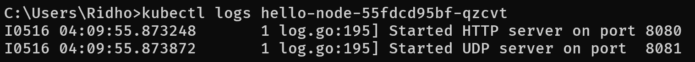
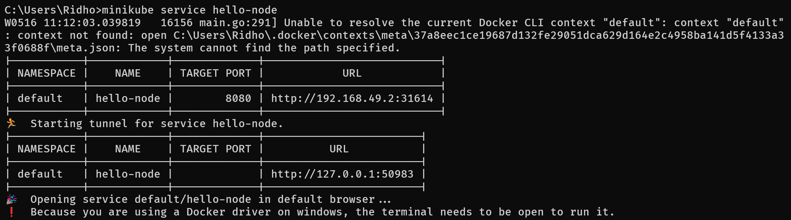
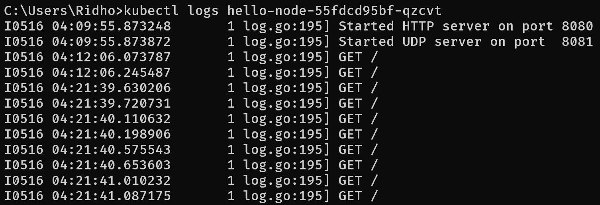

# Tutorial for Advance Programming Course 2023/2024

**Nama** : **Restu Ahmad Ar Ridho**  
**NPM** : **2206028951**  
**Kelas** : **Advance Programming - A**

## Module 11 - Deployment on Kubernetes

### Reflection on Hello Minikube
1. Compare the application logs before and after you exposed it as a Service.
    
    > Hasil dari `kubectl logs hello-node` sebelum melakukan exposing pod.

    
    > Service `hello-node` yang diexpose.

    
    > Hasil dari `kubectl logs hello-node` sesudah melakukan exposing pod.

    Setelah mengekspos _service_, _service_ dapat menerima permintaan dari luar minikube, sehingga log akan mencatat setiap permintaan yang masuk. Misalnya, jika dilakukan beberapa kali membuka app terhadap _service_ hello-node, log akan menunjukkan entri baru untuk setiap permintaan yang diterima oleh _service_ tersebut. Ini mencerminkan aktivitas permintaan yang dihasilkan oleh pengguna yang mengakses _service_ melalui URL yang terkait dengan _service_ tersebut.

2. Notice that there are two versions of `kubectl get` invocation during this tutorial section. What is the purpose of the `-n` option and why did the output not list the pods/services that you explicitly created?
  Perbedaan antara kedua sintaks tersebut adalah bahwa dengan menggunakan opsi -n, kita menyatakan bahwa layanan yang kita inginkan berada pada namespace tertentu. Hal ini penting jika terdapat banyak layanan berbeda dengan nama yang sama di berbagai namespace. Dengan menggunakan -n, kita memfokuskan pencarian pada namespace yang ditentukan setelah opsi -n. Misalnya, kubectl get pods -n kube-system hanya akan menampilkan pod di namespace kube-system, sehingga menghindari kebingungan dengan pod-pod di namespace lain yang mungkin memiliki nama serupa.